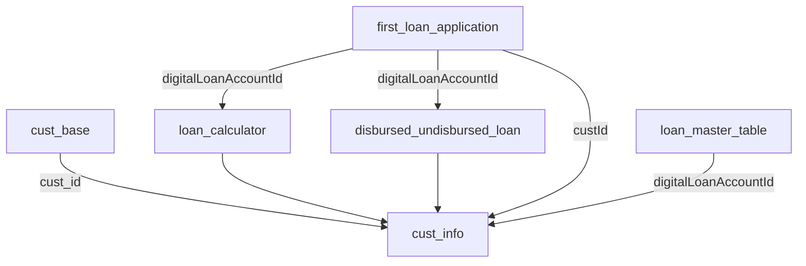

### SQL Query Logic Documentation: Customer Loan Journey Analysis

This query constructs a comprehensive customer profile by analyzing loan application behavior across multiple stages. Below is a detailed breakdown of the logic:

---

#### **1. Base Customer Data (`cust_base`)**  
```sql
with cust_base as (
  select * 
  from `dl_customers_db_raw.tdbk_customer_mtb`
  where cust_id is not null
)
```
- **Purpose**: Filters valid customers from the core customer table.
- **Logic**:
  - Selects all customers with non-null `cust_id`.
  - Commented filters (`status`, `created_dt`) are inactive but indicate potential future use cases.
- **Output**: Foundational customer dataset.

---

#### **2. First Loan Applications (`first_loan_application`)**  
```sql
first_loan_application as (
  select 
    custId,
    digitalLoanAccountId,
    loanaccountnumber,
    isTermsAndConditionstimestamp,
    poi1RejectType,
    loantype 
  from `dl_loans_db_raw.tdbk_digital_loan_application`
)
```
- **Purpose**: Identifies key attributes of customers' first loan applications.
- **Logic**:
  - Pulls loan application data without filtering (commented deduplication logic is inactive).
  - Critical fields: `custId`, loan identifiers, T&C acceptance timestamp, rejection reason, and loan type.
- **Why?**: Serves as the anchor point for loan journey analysis.

---

#### **3. Loan Calculator Engagement (`loan_calculator`)**  
```sql
loan_calculator as (
  select custid, digitalLoanAccountId
  from (
    SELECT 
      fla.custid,
      fla.digitalLoanAccountId,
      SUM(CASE WHEN a.applicationStatus='INITIATE' THEN 1 ELSE 0 END) loan_calculator
    FROM `dl_loans_db_raw.tdbk_status_trace` a
    JOIN first_loan_application fla
      ON fla.digitalLoanAccountId = a.digitalLoanAccountId
    GROUP BY 1,2
  )
  where loan_calculator > 0
)
```
- **Purpose**: Flags customers who initiated a loan calculator session.
- **Logic**:
  - Joins loan applications with status traces to detect `INITIATE` events.
  - Counts `INITIATE` statuses per loan application.
  - Filters for applications with ≥1 calculator session (`loan_calculator > 0`).
- **Output**: `custid` and loan IDs where calculator was used.

---

#### **4. Approved Loans (`disbursed_undisbursed_loan`)**  
```sql
disbursed_undisbursed_loan as (
  SELECT 
    fla.custid,
    fla.digitalLoanAccountId
  FROM `dl_loans_db_raw.tdbk_status_trace` a
  JOIN first_loan_application fla
    ON fla.digitalLoanAccountId = a.digitalLoanApplicationId
  WHERE a.applicationStatus = 'APPROVED'
  GROUP BY 1,2
)
```
- **Purpose**: Identifies loans approved via scorecard.
- **Logic**:
  - Filters status traces for `APPROVED` status.
  - Groups by customer and loan ID to deduplicate records.
- **Note**: Does not imply disbursement (only approval).

---

#### **5. Consolidated Customer Profile (`cust_info`)**  
```sql
cust_info as (
  select 
    cb.*,
    fla.digitalLoanAccountId,
    fla.loantype,
    CASE WHEN lc.custid IS NOT NULL THEN 1 ELSE 0 END AS flg_loan_calculator,
    CASE WHEN fla.poi1RejectType IS NOT NULL OR fla.loantype IS NULL THEN 1 ELSE 0 END AS flg_reject_rule_check,
    CASE WHEN (fla.isTermsAndConditionstimestamp IS NOT NULL OR loan.new_loan_type ='Flex-up') THEN 1 ELSE 0 END AS flg_applied_loan,
    CASE WHEN ul.custid IS NOT NULL THEN 1 ELSE 0 END AS flg_approved_scorecard_loan,
    CASE WHEN fla.loanaccountnumber IS NOT NULL THEN 1 ELSE 0 END AS flg_disbursed_loan,
    fla.loanaccountnumber AS loan_id
  from cust_base cb
  LEFT JOIN first_loan_application fla
    ON CAST(cb.cust_id AS INT64) = fla.custId
  LEFT JOIN loan_calculator lc
    ON lc.digitalLoanAccountId = fla.digitalLoanAccountId
  LEFT JOIN disbursed_undisbursed_loan ul
    ON ul.digitalLoanAccountId = fla.digitalLoanAccountId
  LEFT JOIN risk_credit_mis.loan_master_table loan 
    ON loan.digitalLoanAccountId = fla.digitalLoanAccountId
)
```
- **Purpose**: Creates master customer profile with loan journey flags.
- **Key Flags**:
  1. **`flg_loan_calculator`**: Used loan calculator (0/1).
  2. **`flg_reject_rule_check`**: Rejected by rules or missing loan type (0/1).
  3. **`flg_applied_loan`**: Completed application (T&C accepted or Flex-up loan).
  4. **`flg_approved_scorecard_loan`**: Approved by underwriting (0/1).
  5. **`flg_disbursed_loan`**: Loan disbursed (0/1, based on `loanaccountnumber`).
- **Joins Logic**:
  - Starts with `cust_base` → left-joins to loan applications to ensure all customers are retained.
  - Links to calculator, approval, and disbursement data via `digitalLoanAccountId`.
  - Includes `loan_master_table` for loan type validation (e.g., Flex-up).

---

#### **6. Final Output**  
```sql
select * from cust_info;
```
- Returns all customer profiles with loan journey flags.

---

### **Key Insights & Notes**
1. **Customer Coverage**:
   - Includes **all valid customers** (`cust_id NOT NULL`), regardless of loan activity.
   - Non-applicants will have `NULL` values for loan-related fields.

2. **Journey Progression**:
   - Flags represent funnel stages:  
     `calculator → application → approval → disbursement`
   - A customer may skip stages (e.g., apply without using calculator).

3. **Critical Business Rules**:
   - **Rejection Flag**: Triggered if `poi1RejectType` exists (explicit rejection) or `loantype` is missing (data issue).
   - **Application Flag**: Accepts T&C timestamp OR Flex-up loan type (special case).
   - **Disbursement**: Inferred from presence of `loanaccountnumber`.

4. **Performance Note**:
   - Avoids costly operations (e.g., deduplication in `first_loan_application` is commented out).
   - Aggregations (`loan_calculator`, `disbursed_undisbursed_loan`) minimize row counts early.

5. **Improvement Opportunities**:
   - Uncomment `status`/`created_dt` filters in `cust_base` for specific cohorts.
   - Add deduplication logic for `first_loan_application` if needed.

---

### **Data Flow Diagram**
